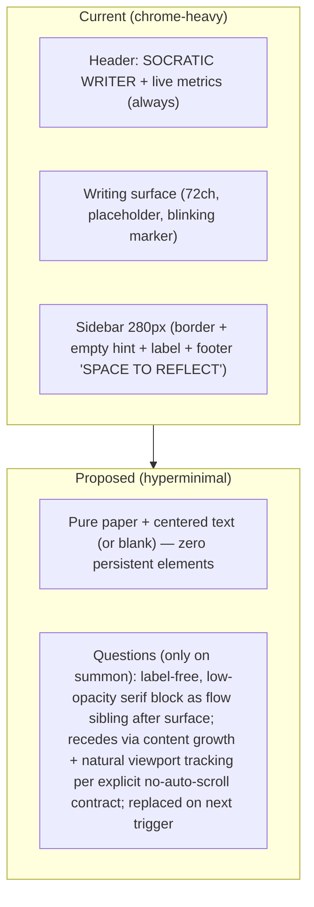

# Design: Hyperminimalism Enhancements for the Socratic Writer UI

**Design ID**: 5ac1b8e3  
**Author**: Systems Architect (Grok Build subagent)  
**Date**: 2026-05-26  
**Status**: Draft  
**Target**: `app/socratic-writer.html` (current reference implementation)  
**Scope**: UI/UX layer only; zero changes to input contract, LLM path, autocorrect, persistence, or backend.

---

## Overview

The Socratic Writer is a single-file browser demo (`app/socratic-writer.html`, ~1400 LOC of HTML/CSS/JS served via `launch.py`) that realizes the ultra-minimalist append-only writing surface defined in `docs/VISION.md`, `docs/CONSTRAINTS.md`, and `docs/INTERACTION-MODEL.md`. The current implementation already enforces the hard rules (strict append-only via `handleKeyDown` + `FORBIDDEN_KEYS`, long-hold space ~650ms as sole meta-action in `startSpaceHold`/`initiateSocraticReflection`, fast silent autocorrect via `FAST_AUTOCORRECT`, background LLM/heuristic with zero blocking of typing).

However, the visual surface still contains persistent "micro-chrome" that violates the *hyper* interpretation of the mandate: "Zero visual clutter at all times. ... The interface must disappear." "A high-quality blank page that happens to have an invisible, wise companion who only speaks when invited."

This design proposes a tightly scoped set of removals and re-presentations that push the experience to true interface disappearance while preserving 100% of the functional contract, the Socratic margin as the single allowed visual exception, and the "does this increase the writer's ability to stay in pure, forward-moving thought?" test for every pixel.

Primary changes:
- Elimination of the always-present two-column flex layout and all idle-state structural chrome.
- Replacement of the labeled, bordered 280px `.socratic-sidebar` with pure, ephemeral, label-free question text that appears inline in the writing flow or as an ultra-minimal transient layer.
- Complete removal of header, live metrics, placeholder, blinking end-marker, sidebar footer, and most status messaging.
- Reduction of the writing surface to a single, centered, high-quality typographic field with no surrounding UI.

The result: when idle, the window contains *only* the writer's text (or true blank paper) on `#f8f1e3`. The companion speaks only on deliberate space-hold and recedes naturally with continued typing.

---

## Background & Motivation

**Current state** (verified via full read of `app/socratic-writer.html` lines 211-248 DOM + CSS 124-207 + render 499-511 + displaySocraticQuestions 855-896):

- `.app-root` is `display: flex` with `.writing-col` (centered 72ch max) + `.socratic-sidebar` (fixed 280px, `border-left: 1px solid var(--margin-border)`).
- `#header` always renders "SOCRATIC WRITER" + `#session-info` (live word count + minutes via `updateSessionInfo`, called on every `render()` and 30s interval). Opacity 0.4, system-ui, 10.5px.
- `.writing-surface` (contenteditable plaintext-only) has `:empty::before` placeholder.
- `.socratic-margin` contains `.label` ("QUESTIONS FROM YOUR TEXT" / "MORE QUESTIONS", uppercase system-ui 10.5px), `.socratic-empty` hint ("Hold space..."), and questions. `.sidebar-footer` always shows "SPACE TO REFLECT" divider.
- `.end-marker` is a blinking 2px accent bar (`soft-blink` 1400ms infinite) appended in every `render()`.
- `.hold-progress` temporary circle on hold.
- `.status-toast` used for multiple messages including reflection acknowledgment.

These elements exist despite the founding documents because the v0 demo prioritized proving the input model and LLM integration (see `DECISIONS.md` entries on Phase 3, `NEXT.md`, `QUICKSTART.md`).

**Pain points** (directly from VISION + CONSTRAINTS enforcement test):
- Persistent header text + live metrics create constant low-level awareness of "using software" and violate "no word counts, time counters, or progress metrics during writing" (CONSTRAINTS §4).
- Sidebar border + footer text + labels are always-present visual weight even when empty (`.socratic-empty` + footer are structural noise).
- Blinking end-marker is the only "cursor" and the only perpetually animating element on the page.
- Placeholder text on first launch teaches the tool rather than disappearing into the blank page.
- "QUESTIONS FROM YOUR TEXT" and "SPACE TO REFLECT" are instructional meta-text that the writer must cognitively filter.

Real usage (per NEXT.md mandate) revealed that these micro-presences prevent the "I forgot the software existed" success criterion.

**Quantification of current footprint**:
- ~280px (≈25-30% of typical 1024-1280px window) permanently allocated to non-text UI.
- 7+ distinct persistent or frequently-updating visual elements when idle (header, session-info, sidebar border, empty hint, footer text+line, end-marker animation, paper background with centered column padding).
- Multiple CSS rules for chrome (labels, flex, borders, 4+ @keyframes/animations, system font overrides).

---

## Goals & Non-Goals

### Goals
- Achieve "interface disappearance": when not actively reflecting, the visible pixels are only the writer's text (or true blank) + high-quality paper background.
- Every remaining visual element must pass the CONSTRAINTS litmus test: "Does this increase the writer's ability to stay in pure, forward-moving thought?" → clear yes.
- Preserve the Socratic questions as a functional, glanceable, ignorable margin/exception without any of its current chrome.
- Maintain identical input contract, timing (650ms hold), LLM/heuristic paths, autocorrect, magic commands (`sampleN`, `export`, `clearall`), persistence, and non-blocking behavior.
- Produce concrete, diff-able changes scoped primarily to the single HTML file (no launch.py or prompt changes required).
- Provide a migration path that remains feasible in the current browser demo and directly informs future native stacks (Tauri/webview, ratatui, wgpu) per ROADMAP.md Phases 4+.

### Non-Goals
- Any new keys, mouse-dependent affordances, editing, formatting, or persistent UI controls.
- Changes to the LLM integration, prompt, proxy in `launch.py`, or data model (questions remain transient UI only).
- Adding "review mode," multiple threads, or export UI during writing (explicitly out of scope per CONSTRAINTS §6).
- Full native rewrite or stack selection (this is UI-layer refinement of the reference demo).
- Animation polish, themes, or accessibility chrome beyond what is required for the core contract.
- Making questions "answerable" in the writing surface.

---

## Proposed Design

### Core Principle
The writing surface is the *entire* experience. The Socratic companion is invisible until deliberately summoned and then manifests as the smallest possible high-signal textual exception that does not compete with the primary text.

### Layout Transformation

**Current (two-column persistent)**:
```
+---------------------------------------------+---------------+
|  [SOCRATIC WRITER]          1423 words • 23m |               |
|                                             |  QUESTIONS... |
|  <writing-surface 72ch>                     |  Q1           |
|                                             |  Q2           |
|  [blinking end-marker]                      |               |
|                                             |  SPACE TO     |
+---------------------------------------------+ REFLECT       +
```

**Proposed (single-column, questions as transient pure text)**:
```
+-------------------------------------------------------------+
|                                                             |
|  <writing-surface 72ch or slightly wider for breathing>     |
|                                                             |
|  Your text here. More paragraphs...                         |
|                                                             |
|  [when summoned]                                            |
|  What tension lives between the first claim and the later   |
|  qualification?                                             |
|                                                             |
|  (questions appear below end on summon; recede via natural  |
|   content growth above sibling per Viewport & Scroll Contract;|
|   no label, no border, replaced on next summon)             |
+-------------------------------------------------------------+
```

When no questions are present: the window is *only* paper background + centered text (or completely empty contenteditable). No header, no sidebar allocation, no borders, no indicators.

### Socratic Question Presentation (the single exception)

Replace the entire `.socratic-sidebar` / `.socratic-margin` / labels / empty / footer with a single, dynamically-inserted, zero-chrome block:

- Appears immediately below the current end of the writer's text (or as the last "committed" visual block before the implicit end).
- Typography: same Georgia family as main text, 0.82–0.88em, line-height 1.55, color `#6b5f52` or lighter with `opacity: 0.48–0.55` (no separate `--ink-light` overrides for labels).
- No `.label`, no "QUESTIONS FROM...", no numbering, no bullets. Just the 1–3 raw question sentences, each in its own minimal wrapper or simple `<div>`s.
- On new reflection: the previous block is removed/replaced entirely (questions are not accumulated visually). This keeps the surface clean.
- Natural aging: continued typing (new `\n\n` paragraphs appended to the surface above the transient sibling) causes the question block to move upward/out of the comfortable lower-third viewport purely as a side-effect of document flow + the browser keeping the insertion point in view. No explicit fade timers, no "dim" logic, and — per the Viewport & Scroll Contract above — no JS scroll calls ever. (See the dedicated subsection for 3-state examples and the no-auto-scroll rule.)
- Positioning: inside the same centered column as the text (or a 1–2px hairline-left variant only while questions are present, collapsed otherwise). No permanent right gutter. This eliminates all layout shift risk in the primary writing column.

**Rationale alignment**:
- Matches INTERACTION-MODEL Option B ("After-Current-Paragraph Overlay") and "quiet margin notes" spirit while removing every pixel of chrome.
- Writer can keep typing at full speed; keystrokes always target the editable surface.
- "Glanceable but ignorable" is achieved by extreme low contrast + lack of any call-to-action language.

### Viewport & Scroll Contract (for Transient Questions)

**Explicit rule (non-negotiable for hyperminimalism + CONSTRAINTS §4 "Nothing in the interface may ever: Move on its own (no auto-scrolling animations that call attention)")**: The `displaySocraticQuestions` implementation (and any future question rendering code) **must never invoke `scrollIntoView()`, `scrollTo()`, `scrollBy()`, `element.scrollTop = ...`, or any other programmatic scroll or viewport adjustment on summon or afterward**. No "gentle scroll so end remains comfortable." The writer alone controls the viewport through continued typing (which appends new paragraphs *above* the transient sibling in document flow) and ordinary mousewheel / scrollbar / trackpad gestures.

**Target DOM insertion point** (minimal change to existing `.inner-col` structure in the single HTML file):

```html
<div class="inner-col">
  <!-- #header removed entirely in hyperminimal state -->
  <div id="surface"
       class="writing-surface minimal"
       contenteditable="plaintext-only" ...></div>

  <!-- Transient questions inserted here (direct sibling AFTER surface, inside the centered column).
       Zero borders, labels, or chrome. Appears only on deliberate space-hold trigger. -->
  <div class="socratic-transient" style="... ultra-low opacity ...">
    What tension lives between the first claim and the later qualification?
  </div>
</div>
```

**"Recedes with typing" mechanics (no JS scroll code)**: Because the transient block is a flow sibling *after* `#surface`, every new paragraph the writer types (`\n\n` + content appended to `currentText`, then `render()` updates `surface.textContent`) grows content *above* the block in the document. The browser's default behavior for a focused contenteditable (keeping the insertion point/caret region in view) causes the viewport to track the typing line downward. The transient block therefore moves relatively upward in (or out of) the viewport purely as a side-effect of the writer's forward action. This is the *only* aging mechanism.

**3 concrete viewport states** (typical desktop Firefox, ~850px viewport height, writer typing at end of text, lower-third comfortable zone, no prior manual scrolling, natural browser behavior):

- **State 0 (immediately after 650ms hold trigger, 0 new paragraphs)**: Transient block renders directly below the last line of the writer's text inside the lower-third of the viewport. Questions are immediately glanceable with zero effort or eye movement beyond normal reading position. No animation, no movement on display.
- **State 1 (after writer has typed 3–6 additional paragraphs / ~5–10 lines)**: New text content now exists above the transient in flow. The block has shifted upward (partially or fully out of the lower-third comfortable zone) solely because the typing line advanced and the viewport tracked it. Questions remain glanceable if the writer pauses briefly; fully ignorable by continuing to type. Still within easy manual scroll range if desired.
- **State 2 (after 12+ new paragraphs or natural continuation of a long session)**: The transient block has moved well above the current viewport or entirely out of view due to continued append-only growth. The visible page once again contains *only* the writer's recent text on paper. The questions have "receded" without any UI element calling attention to itself or requiring dismissal.

This contract differs from the old persistent right sidebar (always 280px visible regardless of scroll/typing) but is *more* aligned with "ignorable" and "interface disappears." It requires zero new scroll logic (current file has none; we add none). For writers who want to revisit old questions they can use the browser scrollbar — a deliberate, heavier action consistent with the tool's philosophy.

The commented "Optional: gentle scroll" in any prototype code is removed; the implementation must contain no such call.

### Removal of Persistent Indicators

1. **Header and session metrics**: Delete `#header` DOM entirely. Delete `updateSessionInfo`, the 30s interval, and all calls from `render()`. Word count / time are explicitly forbidden during writing.
2. **Placeholder**: Delete `.writing-surface:empty::before` rule and content. First launch is a pure blank page. External onboarding (launch.py stdout, README, QUICKSTART) provides the one-time contract education.
3. **End-marker**: Remove `.end-marker` creation in `render()`, the `soft-blink` keyframes + animation, all `#end-marker` queries, and related opacity flashes in `flashTinyRejection`. Add the explicit rule `.writing-surface { caret-color: transparent; }` (and on focus) so that the browser's native I-beam caret is fully suppressed on the focused contenteditable. Internal caret management (`moveCaretToEnd`, `isCaretAtEnd`, focus enforcement, Range/selection logic) remains 100% for append-only correctness and to keep the insertion point at the end, but produces *zero visible pixels or blinking elements*. The text simply grows; the "position" is the end of the buffer. This fulfills the INTERACTION-MODEL preference for no traditional blinking cursor while remaining technically accurate for a contenteditable surface.
4. **Sidebar footer + empty hint**: Entirely deleted. "SPACE TO REFLECT" and the hold instruction are one-time knowledge.
5. **Hold-progress**: Remove the circular indicator DOM, positioning logic in `startSpaceHold`, and `hold-fill` animation. The 650ms threshold is a physical gesture felt in the hand + timer; no visual theater required. (Alternative: an optional 1px horizontal rule pulse at the very end during hold only — still proposed for removal.)
6. **Status toast**: Keep the element and `flashStatus` function *only* for: successful `export` (deliberate ritual) and the single one-time first-ever-launch hint (the minimal acceptable in-UI education signal per new Key Decision #8). Nothing during normal reflection flow or subsequent sessions. Remove "Socratic reflection requested..." and post-reflection coaching toasts. The toast is lower-contrast and short-lived.

### CSS & Typography Simplifications

- Remove all system-ui / sans rules for labels and footers (they were the primary source of "UI" texture).
- Unify question text to the same Georgia stack as the surface (remove 'Instrument Serif' reference).
- Delete or nullify: `.header`, `.socratic-sidebar`, `.socratic-empty`, `.sidebar-footer`, `.flex-line*`, most `.minimal` and decorative rules.
- Simplify `.app-root` / `.writing-col` / `.inner-col` to a single centered column with generous but minimal vertical padding (e.g., `padding: 4rem 2rem` top/bottom for breathing room on long sessions; no horizontal chrome).
- Add `.writing-surface { caret-color: transparent; }` (and `:focus` variant) as the explicit rule that makes removal of the custom end-marker produce zero visible browser caret. Remove 3 of the 4 keyframe blocks; retain only if any essential micro-interaction survives.
- Paper background (`--paper: #f8f1e3`), ink, and accent remain but are used far less often.
- Resulting CSS reduction: estimated 60–90 lines removed, dozens of selectors and properties eliminated.

### JavaScript Changes (minimal surface area)

- `render()`: Only sets `surface.textContent = currentText`. No marker, no `updateSessionInfo`.
- `displaySocraticQuestions`: Rewritten to create a transient sibling (or absolutely-positioned ultra-low-chrome container) with the raw questions. No label creation, no `socraticEmpty`/`socraticContent` toggling, no `socraticPane.active`. Previous question block is cleared on each new call.
- Remove or guard: `sessionInfo`, `socraticEmpty`, `socraticContent`, `socraticPane`, `holdIndicator` references.
- `init()`: Strip first-time toast if we go fully silent; keep only if external education is judged insufficient. Remove mouse-cursor hiding timer if it is viewed as unnecessary "feature" (actually defensible for immersion — recommend keeping as non-persistent enhancement).
- Magic command and reflection paths unchanged except for the new display function.
- All forbidden-key, autocorrect, composition, paste, and caret-enforcement logic untouched.

### Mermaid: Before / After Layout



```mermaid
sequenceDiagram
    participant W as Writer
    participant JS as JS Handlers (unchanged contract)
    participant Surf as Writing Surface
    participant Q as Transient Question Block (new)

    W->>JS: Types (append-only, 0 latency)
    JS->>Surf: Grows textContent; no marker, no header updates

    W->>JS: Hold space 650ms at end
    JS->>JS: correctTrailingWord + tryMagic or initiateSocraticReflection (async LLM/heuristic)
    Note over JS: Zero visible during wait (no toast, no spinner, no hold circle)
    JS->>Q: displaySocraticQuestions (pure text, 1-3 sentences, no chrome)
    Surf-->>W: Writer continues typing instantly; questions visible but ignorable
    W->>JS: More typing
    JS->>Surf: New paragraphs appended above the transient sibling in flow; viewport naturally tracks typing line (no JS scroll); block recedes upward per Viewport & Scroll Contract (no auto-scroll calls ever)
```

### Data Model / Persistence Impact
None. Questions remain purely transient DOM (never serialized into `currentText` or localStorage). `currentText` and export behavior identical. No schema changes.

### Implementation Feasibility

**Browser demo (today)**: Trivial. All changes are deletions + one new ~25-line `displaySocraticQuestions` variant + CSS purge inside the single file. The existing keyboard test harness (bottom of HTML + `tests/keyboard_simulator.py`) continues to pass because input paths are untouched. Fullscreen + mouse-hide behaviors can remain or be trimmed.

**Future native stacks (ROADMAP Phases 4+)**:
These notes are *informational and non-binding*. The single-file browser demo remains the sole reference implementation until a native stack is selected and a new design document is written for it.
- Tauri/webview: The same (or ported) HTML/CSS/JS can be reused directly; all hyperminimalism changes apply with zero additional work.
- Ratatui / crossterm (or other TUI): The main text buffer owns the screen. Questions could appear as dimmed lines in a footer region that appears only on trigger and is cleared on next input burst or explicit refresh. No borders, no labels. "Recede" would be implemented by the TUI's normal buffer scrolling / viewport model rather than DOM flow.
- wgpu/canvas (or SDL/custom): Text layout owns the frame; a question block could be a second low-alpha text run positioned after the last paragraph and clipped by the viewport. Aging via continued appends + viewport tracking.
Any future native work must still obey the same Viewport & Scroll Contract (no auto-scroll on summon) and zero-persistent-chrome rules. The current design does *not* become the authoritative reference for Phase 4+ without a dedicated follow-up design exercise.

---

## API / Interface Changes

No public API. The "interface" here is the visual + input contract.

**Before (selected DOM/CSS surface)**:
- Persistent `#header`, `.socratic-sidebar` (280px), `.label`, `.sidebar-footer`, `:empty::before` placeholder, `.end-marker` with animation.

**After (target state)**:
- Single `#surface` contenteditable as the complete visual field, with the rule `.writing-surface { caret-color: transparent; }` (and on focus) ensuring the browser renders no visible I-beam caret.
- Transient question container created on demand with class `socratic-transient` (or inline style only):
  ```html
  <div class="socratic-transient" style="margin-top:1.25rem; font-size:0.86em; line-height:1.58; color:#6b5f52; opacity:0.52;">
    What is the real tension underneath the first thing you wrote?<br>
    ...
  </div>
  ```
- Zero other elements in the primary render tree when idle.

**JS surface (before/after critical functions)**:
- `render()` shrinks dramatically (see snippet below).
- `displaySocraticQuestions` changes from sidebar manipulation to transient block injection.
- `updateSessionInfo` and related intervals deleted.

**Concrete before/after snippet (render function)**:

```js
// BEFORE (lines ~499-511)
function render() {
  surface.textContent = currentText;
  const marker = document.createElement('span');
  marker.className = 'end-marker';
  marker.id = 'end-marker';
  surface.appendChild(marker);
  requestAnimationFrame(moveCaretToEnd);
  updateSessionInfo();
}

// AFTER (hyperminimal)
function render() {
  surface.textContent = currentText;
  // No marker. No session info. Native caret suppressed via `.writing-surface { caret-color: transparent; }`.
  // Caret position remains enforced internally via Range/selection for append-only correctness.
  requestAnimationFrame(moveCaretToEnd);
}
```

**Question display (new minimal version)**:

```js
function displaySocraticQuestions(questions) {
  // Remove any prior transient block
  const prior = document.querySelector('.socratic-transient');
  if (prior) prior.remove();

  if (!questions || questions.length === 0) return;

  const block = document.createElement('div');
  block.className = 'socratic-transient';
  // Ultra-minimal inline styles or a 4-rule CSS block only
  block.style.marginTop = '1.4rem';
  block.style.fontSize = '0.86em';
  block.style.lineHeight = '1.58';
  block.style.color = '#6b5f52';
  block.style.opacity = '0.52';
  block.style.fontFamily = 'Georgia, "Times New Roman", serif'; // unify

  questions.forEach(q => {
    const p = document.createElement('div');
    p.textContent = q;
    p.style.marginBottom = '0.55rem';
    block.appendChild(p);
  });

  // Insert after the surface (direct sibling inside .inner-col).
  // Per Viewport & Scroll Contract: NO scrollIntoView or any programmatic scroll adjustment here or anywhere.
  const container = surface.parentElement || document.querySelector('.inner-col');
  container.appendChild(block);
}
```

All other call sites (`initiateSocraticReflection`, magic commands, etc.) call the new function with zero other UI side-effects.

---

## Data Model Changes

None. Transient UI only. Export (`exportText`) continues to emit exactly `currentText` with no questions mixed in.

---

## Alternatives Considered

### Alternative 1: Ultra-Thin Persistent Right Gutter (Minimal Sidebar, Zero Text)
Keep a 1–3px hairline or 40px collapsed gutter on the right at all times. On reflection, the gutter "expands" (via CSS grid or flex) to ~160px and hosts pure questions with no label/footer. Questions remain until next trigger or manual clear.

**Trade-offs**:
- Pros: Familiar "margin" metaphor from INTERACTION-MODEL; zero reflow of main text column; questions always spatially separated.
- Cons: Permanent allocation of pixels and a visible vertical line even when idle (violates "zero visual clutter" and "interface must disappear"). The hairline itself becomes a constant reminder of the companion. More complex responsive/centering logic. Rejected for hyperminimalism.

### Alternative 2: Ephemeral Bottom Overlay / Toast-Style Questions
Questions appear in a fixed-position, borderless, fully transparent-background bar anchored to the bottom of the viewport (or lower-right corner). Auto-dismiss after 18–25 seconds or after the writer types 2–3 new paragraphs. Pure text, extreme low opacity.

**Trade-offs**:
- Pros: Main writing surface never shares space; questions are guaranteed to age out without any typing effort; easy to implement with a single fixed div.
- Cons: Overlaps the lower part of the text when the writer is at the bottom of a long document (risk of visual interference during continued typing). "Toast" semantics feel like notifications (explicitly discouraged in CONSTRAINTS). May require careful z-index and scroll handling. Less "part of the page" feeling than inline flow. Acceptable but inferior to the inline transient block for the "high-quality blank page" goal.

### Alternative 3: Questions Never Appear Visually Until Explicitly Summoned Again (Pure Background)
Space hold records the request; questions are computed but shown only if the writer later performs another action (e.g., triple-space or a second hold). No automatic display.

**Trade-offs**:
- Pros: Maximum disappearance; zero visual exception ever unless re-requested.
- Cons: Violates the core "when you press the space bar... a small, elegant margin note or quiet overlay appears" contract in VISION and INTERACTION-MODEL. Reduces the value of the deliberate trigger (writer has no immediate feedback that the reflection happened). Makes the feature feel broken on first use. Rejected as too far; the Socratic component must deliver visible value on the intentional gesture.

### Alternative 4: Questions Visible Only During the Hold or Briefly (N seconds) After Release (True Transient Overlay)
The block (or a minimal fixed-position overlay with no border) appears only while the space bar is physically held (or for a short fixed window, e.g. 12–18 seconds after release) and then disappears completely with no scroll/viewport reasoning required. Pure text, extreme low opacity, no aging logic, no flow sibling.

**Trade-offs**:
- Pros: Simplest possible viewport contract (no "recede" mechanics at all); maximum ephemerality; zero risk of questions lingering in view or affecting layout/scroll position; requires almost no DOM or CSS beyond a temporary absolutely-positioned container.
- Cons: The writer must read (or decide to ignore) the questions *while still holding the space bar or immediately afterward under time pressure*. This changes the gesture from "deliberate summon for reflection" (release and then think) into a "read while holding" action, which may feel rushed or physically awkward for 1–3 thoughtful questions. It also reduces the "glanceable later while continuing to type" experience that real usage has shown to be valuable. The chosen flow-sibling approach was preferred because it gives the writer time to read at their own pace after the physical hold gesture completes, while still guaranteeing natural disappearance through forward writing (the primary activity). This alt was considered but rejected for the current design in favor of the "lives in page flow until naturally aged" variant.

The chosen design (transient label-free inline block that lives in the text flow and ages naturally per the explicit Viewport & Scroll Contract) is the tightest fit to "high-quality blank page + invisible wise companion who only speaks when invited" while still delivering usable Socratic value after the trigger.

---

## Security & Privacy Considerations

No new attack surface. All changes are client-side DOM/CSS/JS presentation only.

- Text is still never sent except on explicit space-hold (existing `initiateSocraticReflection` + proxy path in `launch.py`).
- No new storage of questions or metadata.
- Removal of live word-count display actually *reduces* any accidental self-surveillance during writing.
- Same-origin proxy and local Ollama assumptions unchanged.
- Fullscreen attempt and cursor hiding (if retained) have no privacy implications.

Threat model remains identical to current v0.

---

## Observability

**Writing mode (primary)**: Zero new or retained logging/metrics. The design removes the periodic `updateSessionInfo` timer and most `flashStatus` calls. The only console output that survives is the existing developer hint on load (harmless) and the hidden keyboard test harness.

**During reflection**:
- Existing LLM success/failure paths and heuristic fallback remain (they log nothing to the writer).
- Transient question block creation can be instrumented with a single console.debug for development only (never surfaced).

**Alerting / production**: N/A for the demo. In a future packaged app, the same "no telemetry" rule from CONSTRAINTS §8 applies.

The reduction in status toasts and timers is itself an observability win: less noise means any real anomaly (e.g., input lag) would be more noticeable to the maintainer during real writing sessions.

---

## Rollout Plan

All changes are deletions + one small new rendering path inside the single reference file. Low risk. **The HYPERMINIMAL flag gates all visual changes from the first commit.**

1. **Feature flag (day 1, non-negotiable)**: A local boolean `const HYPERMINIMAL = false;` (or URL param) is introduced in PR 1 and *must* gate every deletion and the new transient rendering path. While false, the original (current) chrome + sidebar + end-marker + header behavior remains 100% intact so the main branch always has a working Socratic experience. The flag is the only way new behavior is enabled. "Flag day" (flipping the default to true and eventually removing the old code paths) occurs only after the full validation gate below.
2. **Staged within demo** (sequenced; not all independently mergeable because intermediate states would break the Socratic UI):
   - PR 1: Introduce HYPERMINIMAL flag + pure deletions (header, session metrics, live timers, sidebar DOM/CSS skeleton, placeholder, end-marker, footer) *behind the flag*. Old behavior is the default.
   - PR 2: New transient question block + minimal CSS, also gated by the flag.
   - PR 3: Polish (toast reduction, hold indicator removal, animation cleanup) gated by the flag.
3. **Validation gate (mandatory before any flag flip or PR 4-equivalent work)**: After PR 3 lands (with flag still defaulting to false), the team must perform *at least one 30+ minute real writing session with `HYPERMINIMAL = true`* (plus full `SW.runKeyboardTests()` + simulator) and confirm the experience meets the hyperminimalism + glanceable/ignorable goals before any further PRs or flag-day changes. Only then is the flag default flipped (or old paths deleted).
4. **Rollback**: Trivial — set flag false or revert the single file. No data migration.
5. **Documentation**: Update `QUICKSTART.md`, `README.md`, and `NEXT.md` post-merge (and after flag day) to describe the now-even-quieter experience. No changes to `docs/CONSTRAINTS.md` or `VISION.md`.
6. **Future native**: See scoped note in Implementation Feasibility. The cleaned-up spec is *informational* only for Phase 4+; the browser demo remains the reference implementation.

---

## Open Questions

1. Should the transient question block ever carry a microscopically faint left hairline (1px, 20% opacity) only while visible, or must it be pure text with zero lines?
2. For very long sessions, should prior question blocks be kept in a scrollable "history gutter" that is still invisible until deliberately summoned again (e.g., via a second space hold while at top), or are all questions strictly ephemeral per reflection?
3. Is complete removal of the hold-progress circle acceptable, or does a 650ms gesture benefit from a single-pixel confirmation that does not call attention?
4. For first-time users with zero external context, does the retained one-time ephemeral flashStatus + launch.py printed rules + QUICKSTART (per Key Decision #8) prove sufficient for discovering the space bar contract, or will real usage data require strengthening the *external* materials only (never new persistent in-UI chrome)?
5. In any future native TUI/canvas ports (after the browser demo is proven), what is the exact analog of the Viewport & Scroll Contract + "recedes with typing" behavior (e.g., questions live in a separate virtual viewport that the main buffer scrolls past, or a trigger-only footer cleared on next burst)? See the now-scoped notes in Implementation Feasibility.

These will be resolved by building the prototype changes and using the tool for real work, per project principles.

---

## References

- `docs/VISION.md` — Core intent and "interface must disappear"
- `docs/CONSTRAINTS.md` — Non-negotiable rules, especially §1–4, §7 (performance), enforcement test
- `docs/INTERACTION-MODEL.md` — Exact UX, space bar requirements, margin vs. overlay options, typography rules
- `docs/ROADMAP.md` — Phase 3 (current) → Phase 4 polish; native stack considerations
- `docs/DECISIONS.md` — Strict append-only, space as sole meta-action, fast silent autocorrect, LLM integration
- `context/INITIAL-BRIEFING.md` + `SESSION-NOTES-2026-04-inception.md`
- `app/socratic-writer.html` (full current implementation, especially render, displaySocraticQuestions, handleKeyDown, CSS blocks for header/sidebar/end-marker)
- `launch.py` (unchanged server + proxy)
- `prompts/socratic-reflector-v0.md` (unchanged)
- `tests/keyboard_simulator.py` + `KEYBOARD-ROBUSTNESS.md` (must continue to pass)
- `NEXT.md`, `README.md`, `QUICKSTART.md`

---

## Key Decisions

1. **Header + live session metrics removed entirely** — Directly required by CONSTRAINTS §4 prohibition on word counts/time counters during writing and VISION "zero visual clutter." Live updating elements are cognitive presence even at low opacity.

2. **End-marker (blinking caret) eliminated + native caret suppressed via CSS** — Aligns with INTERACTION-MODEL explicit preference for "no cursor in the traditional blinking sense if we can avoid it." The append-only contract plus JS enforcement (`moveCaretToEnd` etc.) makes a visible marker unnecessary. Explicit `.writing-surface { caret-color: transparent; }` (verified absent in current CSS) is added so removing the custom `.end-marker` span truly yields zero visible caret pixels (no browser I-beam). This makes the "zero visible pixels" claim accurate for the contenteditable implementation. Risk accepted: some writers may initially miss a visual anchor; mitigated by the fact that one cannot move the insertion point anyway. Re-test with harness + real sessions required after change.

3. **Socratic sidebar (280px + border + labels + footer + empty state) replaced by transient label-free inline/low-contrast text block** — The margin is the sole allowed visual exception, but every other pixel of its current presentation (system font labels, "QUESTIONS FROM YOUR TEXT", "SPACE TO REFLECT", persistent structure) is pure chrome. The new presentation keeps the questions glanceable and ignorable while making them part of the page flow that naturally ages. This is the highest-leverage single change for "interface disappearance."

4. **Placeholder text on empty surface removed** — A true blank page on first launch is closer to the physical notebook metaphor in VISION than any instructional text. Onboarding lives in launch output and docs.

5. **Status toasts and hold indicator de-emphasized or removed** — Multiple toasts during reflection flow and the circular progress were low-level theater. The gesture itself + the eventual appearance of questions are sufficient acknowledgment. Only export success (a deliberate ritual) retains a quiet confirmation.

6. **All changes scoped to presentation layer in the reference HTML** — No impact on input model, LLM contract, or persistence. This keeps the PR surface small, the keyboard test harness valid, and the design directly portable to future native renderers.

7. **No new features or controls** — Even "summon info" or review affordances were considered and rejected to avoid decision fatigue. The space bar remains the *only* meta-action.

8. **First-use education contract (minimal acceptable signal)** — Zero persistent in-UI education (no placeholder, no `.socratic-empty` hint, no sidebar footer "SPACE TO REFLECT", no labels, no always-visible invitation). The *only* in-UI signal retained is the existing single, one-time, low-contrast, auto-dismissing `flashStatus` on very first fresh load (current ~1600ms behavior in init(); disappears on first keystroke or after a few seconds). Primary contract education is external and one-time: launch.py printed rules (visible even when launching via Desktop icon, since it spawns the terminal process or shows output), QUICKSTART.md, and README. This is the minimal signal that still makes the sole meta-action (space bar) discoverable without adding any lasting visual presence or decision points inside the writing surface. If real usage after the changes shows first-time writers consistently failing to discover the 650ms hold, the external materials will be strengthened before any in-UI addition is considered. No "Education surface" subsection that would introduce new persistent or semi-persistent pixels is added.

---

## PR Plan

PRs are **sequenced** with the `HYPERMINIMAL` feature flag (introduced in PR 1) as the safety gate. They are **not** independently mergeable in the sense that would leave the main branch with a broken or missing Socratic experience for real writing. Each PR must still pass the full keyboard test suite. Real writing validation with the flag *enabled* is required after PR 3 (see Rollout Plan validation gate) before any subsequent work or flag flip.

**PR 1: Title: "Introduce HYPERMINIMAL flag + remove persistent header, session metrics, and live timers (gated)"**  
Files: `app/socratic-writer.html` (flag constant + gating logic; DOM header block, CSS .header/.session-info, JS updateSessionInfo + intervals + calls in render/init — all behind `if (HYPERMINIMAL)`)  
Deps: None  
Description: Introduces the required flag on day 1 (default false = current behavior). Deletes ~35 lines of chrome *only when flag is true*. Verifies no behavioral change to typing or reflection trigger when flag=false. "Flag day" (default flip + old path removal) is explicitly deferred until after the post-PR3 real-writing gate.

**PR 2: Title: "Eliminate blinking end-marker and related caret visuals + caret-color rule (gated)"**  
Files: `app/socratic-writer.html` (CSS .end-marker + @keyframes + new `.writing-surface { caret-color: transparent; }`, render() marker creation, all #end-marker queries, flashTinyRejection marker logic — gated)  
Deps: None (or after PR 1)  
Description: Removes the custom marker and adds the explicit caret suppression rule behind the flag. Internal moveCaretToEnd / isCaretAtEnd / focus enforcement / Range logic is preserved (and audited per Issue 6 feedback). Test harness unaffected.

**PR 3: Title: "Purge sidebar chrome, footer, empty state, placeholder, and associated CSS/JS (gated)"**  
Files: `app/socratic-writer.html` (full .socratic-sidebar + .socratic-margin + .socratic-empty + .sidebar-footer + .label rules and DOM, :empty::before placeholder, hold-indicator, flex layout adjustments on .app-root/.writing-col — all gated by HYPERMINIMAL)  
Deps: PR 1 + PR 2 recommended for clean diff  
Description: Largest deletion PR (~120–180 lines CSS + HTML + JS references) behind the flag. Converts the app to a single centered column when enabled. Temporarily (when flag=true) the Socratic UI is provided by PR 2's new block. **After this PR lands, a mandatory 30+ minute real writing session with HYPERMINIMAL=true + full `SW.runKeyboardTests()` + manual caret/focus/click enforcement smoke test in Firefox (verifying all Range/selection, isCaretAtEnd, moveCaretToEnd, paste, and click snap logic still enforce append-only correctly after the flex-to-single-column layout change) is required before PR 4 or flag-day work.** 

**PR 4: Title: "Introduce transient label-free Socratic question block (hyperminimal presentation, gated)"**  
Files: `app/socratic-writer.html` (new minimal displaySocraticQuestions implementation or variant implementing the Viewport & Scroll Contract, 4–8 lines of new CSS or inline styles, call sites in initiateSocraticReflection + sample loaders + magic — gated)  
Deps: PR 3 (the container structure must exist) + successful post-PR3 real-writing validation gate with flag enabled  
Description: The single additive change (behind flag). Questions now appear as pure low-opacity serif text as a flow sibling, with no labels, borders, or persistent elements, following the explicit no-auto-scroll contract. Replaces the old sidebar rendering completely when enabled.

**PR 5: Title: "De-emphasize status toasts and hold indicator; final CSS/JS cleanup (gated)"**  
Files: `app/socratic-writer.html` (reduce flashStatus call sites, optionally remove or heavily style .status-toast, remove hold-progress entirely if not done in PR 3, delete unused variables and dead code paths, any remaining animation/transition rules — gated)  
Deps: PR 4  
Description: Ruthless final pass behind the flag. Leaves only the absolute minimum necessary for export success feedback (if retained).

**PR 6 (optional, post-merge polish): Title: "Update documentation for the hyperminimal surface"**  
Files: `README.md`, `QUICKSTART.md`, `NEXT.md` (minor wording updates describing the now-quieter experience; no constraint changes)  
Deps: All prior PRs landed + flag day complete  
Description: Reflects reality for new users. Does not alter any founding docs.

**Overall merge order recommendation**: 1 → 2 → 3 (then mandatory real-writing + harness + caret audit validation gate with HYPERMINIMAL=true) → 4 → 5 → (flag day + PR 6). Total changed LOC in the HTML: net reduction of ~150–220 lines. Zero new runtime dependencies or external assets. The flag ensures the tree never ships a broken Socratic experience to the team during development.

---

*This design document is the direct response to the task "Evoke hyperminimalism enhancements for the Socratic Writer UI" under the explicit user goal of hyperminimalism, while treating the full set of founding documents as the non-negotiable constitution.*
